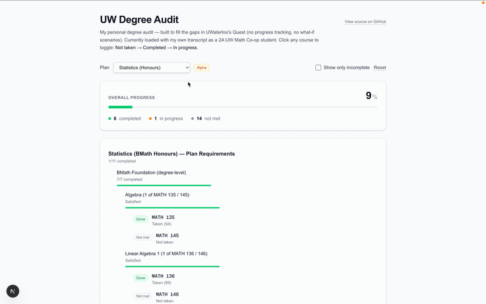

# UW Degree Audit

Interactive degree-requirement audit for UWaterloo Math Faculty students — built to fill the gaps in Quest (no progress tracking, no what-if scenarios). Fully client-side and privacy-preserving: no backend, no database, no user data leaves the browser.



**[Live demo](https://uw-degree-audit.vercel.app)**  ·  Built with Next.js, TypeScript, Tailwind

---

## Why

UWaterloo's official degree-audit tool (Quest) has three frustrating gaps:

- No visual progress tracking — you can't tell at a glance how close you are to graduating
- No what-if scenarios — "if I drop this course, am I still on track?" requires manually reading the catalog
- No support for exploring alternative plans — switching from one major to another means starting over

This tool fills those gaps for the Math Faculty's three most common Honours plans.

## Features

**Three plan support** — Pure Mathematics, Computer Science (BMath), and Statistics. Each is modeled from the real UW Academic Calendar with the BMath foundation requirements shared across all three.

**Real-time what-if engine** — Click any course to cycle its status (`Not taken` → `Completed` → `In progress`). The entire requirement tree re-evaluates instantly across a three-state model. Original transcript grades are restored when toggling a course back to completed.

**Filter to focus** — A toggle hides completed requirements so you only see what's left.

**Privacy-first** — All transcript data lives in your browser session. No backend, no database, no analytics, no tracking.

## Architecture

The core abstraction is a **recursive AST** with 5 typed node constructors:

```typescript
type Requirement =
  | { kind: "course";  code: string; minGrade?: number }
  | { kind: "and";     label: string; children: Requirement[] }
  | { kind: "or";      label: string; children: Requirement[] }
  | { kind: "count";   label: string; min: number; from: Requirement[] }
  | { kind: "average"; label: string; min: number; over: Requirement[] };
```

A ~160-line structural-recursion evaluator walks this tree against a transcript, producing a parallel `EvalResult` tree with a **three-state status model** (`completed` / `in-progress` / `not-met`).

The evaluator leverages TypeScript's **discriminated unions and exhaustiveness checking** — adding a new requirement kind forces every dependent `switch` arm to update at compile time. This is what makes adding a new plan or refactoring a status model safe across the whole codebase.

The progress semantics are intentionally conservative: an `in-progress` course contributes `0` to progress, not `0.5`. Until a grade is in hand, the course could still be dropped or failed, so claiming partial completion would mislead.

## Plans

Each plan lives in its own file under `lib/plans/`, modeled from the UW catalog:

- `pmath-major.ts` — Pure Mathematics (Honours)
- `cs-major.ts` — Computer Science (BMath Honours)
- `stats-major.ts` — Statistics (BMath Honours)
- `bmath-foundation.ts` — Shared degree-level foundation (MATH 135/136/137/138, first-year CS, STAT 230, Communication Part 1)

The `bmath-foundation` module is composed into all three plans, so any 1A/1B course you've completed counts toward every plan you might switch to.

## Limitations

The current `Requirement` type system intentionally cannot express:

1. **Wildcard / range matching** — "any CS 400-level course". Worked around with hand-maintained course lists.
2. **Unit-based counting** — "13.75 units of math". Not modeled.
3. **Subject-code / faculty filters** — "1.0 unit from Faculty of Arts". Elective Requirements not modeled.
4. **Course consumption** — A single course can satisfy multiple requirements (no tracking of "used").
5. **Substitution rules** — Double-degree substitutes (STAT 371 → STAT 331, etc.) not modeled.
6. **Negative constraints** — "STAT 334 is not an acceptable substitute". Forbidden courses simply excluded from option lists.

Every limitation is flagged with a `TODO:` or `NOT MODELED:` comment in the plan files, so the audit is honest about what it can and can't check. **Always verify graduation status against Quest before making real decisions.**

## Tech stack

| | |
|---|---|
| Framework | Next.js 14 (App Router) |
| Language | TypeScript (strict mode) |
| Styling | Tailwind CSS |
| Testing | Jest + ts-jest (36 tests covering all 5 evaluator cases) |
| Deployment | Vercel |

## Local development

```bash
git clone https://github.com/Maulwurf-UWaterloo/uw-degree-audit.git
cd uw-degree-audit
npm install
npm run dev
```

Open [localhost:3000](http://localhost:3000).

Run tests:

```bash
npx jest
```

## Project structure

```
app/
  page.tsx                  # Main UI: header, plan switcher, summary card, tree view
  layout.tsx
lib/
  types.ts                  # Requirement, Course, EvalResult types
  evaluator.ts              # Structural-recursion evaluator (~160 lines)
  evaluator.test.ts         # 36 Jest tests covering all 5 node kinds
  plans/
    index.ts                # Plan registry
    bmath-foundation.ts     # Shared BMath degree-level foundation
    pmath-major.ts
    cs-major.ts
    stats-major.ts
data/
  sample-transcript.ts      # Personal transcript (toggle-able courses)
```

## Disclaimer

Not affiliated with the University of Waterloo. Plan data is modeled from public catalog information and is best-effort — always verify against Quest before making graduation decisions.

## Author

Built by Wu Tung-li ([@Maulwurf-UWaterloo](https://github.com/Maulwurf-UWaterloo)) — UWaterloo Math, 2A.

## License

MIT
